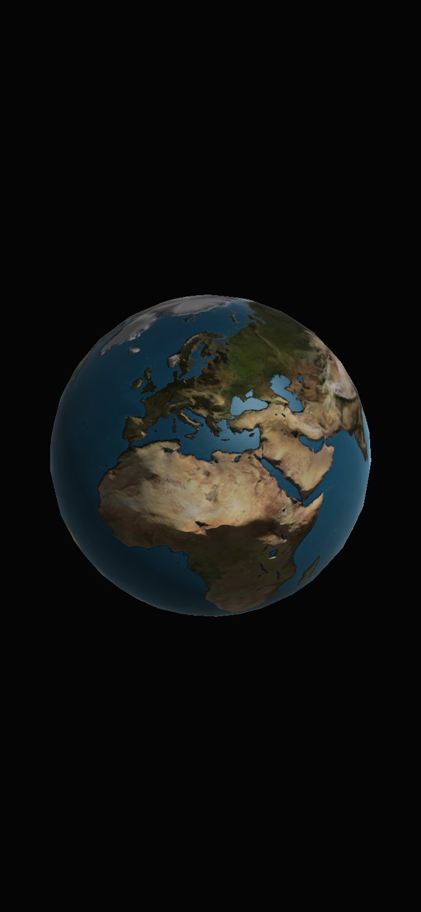

# Earth

    

A globe I made to try out normal mapping in my old game engine back when I was learning to program.

<!--  Google Play: https://play.google.com/store/apps/details?id=anton.forsberg.earth -->

<table>
  <tr>
    <td>
         
    </td>
    <td>
        
    </td>
  </tr>
</table>

